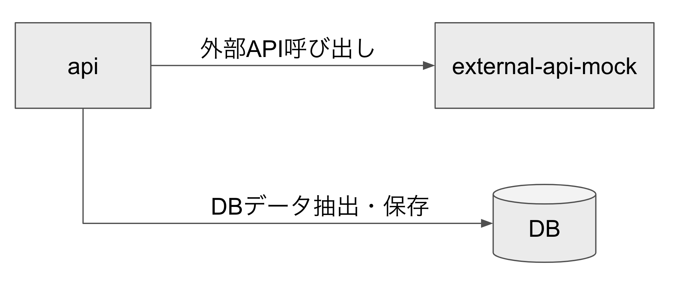

Table of Contents
- [1. サンプルアプリの全体像](#1-サンプルアプリの全体像)
- [2. プロジェクト構成](#2-プロジェクト構成)
  - [2.1. api](#21-api)
  - [2.2. external-api-mock](#22-external-api-mock)
- [3. サンプルアプリの実行、テスト方法](#3-サンプルアプリの実行テスト方法)
  - [3.1. api](#31-api)
    - [3.1.1. 実行準備](#311-実行準備)
    - [3.1.2. UT 実行方法](#312-ut-実行方法)
    - [3.1.3. Server 実行方法](#313-server-実行方法)
    - [3.1.4. 動作確認方法](#314-動作確認方法)
  - [3.2. external-api-mock](#32-external-api-mock)
    - [3.2.1. 実行準備](#321-実行準備)
    - [3.2.2. Server 実行方法](#322-server-実行方法)

## 1. サンプルアプリの全体像


## 2. プロジェクト構成
| プロジェクト      | 概要                                                  |
| ----------------- | ----------------------------------------------------- |
| api               | API のアプリケーションプロジェクト                    |
| external-api-mock | API からさらに外部の API を想定した Mock プロジェクト |

### 2.1. api
```
├── coverage # Jestテストのカバレッジ情報
├── env # 環境変数
├── index.ts # API起動時に最初に実行するファイル
├── load-env.ts # 環境変数のパスをカスタマイズするファイル
├── node_modules # package.jsonに記載されたライブラリの実体
├── package-lock.json
├── package.json
├── specs # テストファイルを保存
│   ├── api-test # APIテストのテストケースを保存
│   ├── helper # テストをやりやすくするためのユーティリティ
│   └── unit-test # 単体テストのテストケースを保存(ディレクトリ構造はsrcと同じ)
│       ├── application
│       ├── domain
│       ├── infrastructure
│       └── interface
├── src # プロダクトコードを保存(Clean Architectureに基づいたディレクトリ構造)
│   ├── application
│   │   ├── gateways # gatewayのインターフェース
│   │   └── usecases
│   ├── domain
│   │   └── entities
│   ├── exception # 異常系関連クラス
│   │   ├── CustomError.ts
│   │   └── ErrorCodes.ts
│   ├── infrastructure # infrastructureの実体
│   │   ├── DBClient.ts
│   │   ├── ExpressInterfaceAdapter.ts
│   │   └── HttpClient.ts
│   └── interface
│       ├── controllers
│       └── gateways # gatewayの実体とinfrastructureのインターフェース
├── test-report.html # Jestのテストレポートファイル
├── test-report.xml # Jestのテストレポートファイル
└── tsconfig.json # Typescriptの設定ファイル
```

### 2.2. external-api-mock
```
├── package-lock.json
├── package.json
├── server.ts # mocker serverを起動するファイル
├── tsconfig.json # Typescriptの設定ファイル
└── typings # mock-http-serverをTypescriptで使えるように自作したTypeファイル
    └── mock-http-server.d.ts
```

## 3. サンプルアプリの実行、テスト方法

### 3.1. api

express をベースとして API Server です。  
Clean Architecture のサンプル実装となります。

#### 3.1.1. 実行準備

```
cd api
npm ci
```

#### 3.1.2. UT 実行方法

```
npm run test
```

#### 3.1.3. Server 実行方法

```
npm run start
```

#### 3.1.4. 動作確認方法

※下記を実行する前に、external-api-mock を実行してください。

```
curl localhost:3000/api/users
[{"id":1,"name":"User1","email":"user1@test.local"},{"id":2,"name":"User2","email":"user2@test.local"},{"id":3,"name":"User3","email":"user3@test.local"}]
```

### 3.2. external-api-mock

api から呼び出す外部 API の Mock Server です。

#### 3.2.1. 実行準備

```
cd api
npm ci
```

#### 3.2.2. Server 実行方法

```
npm run start
```
